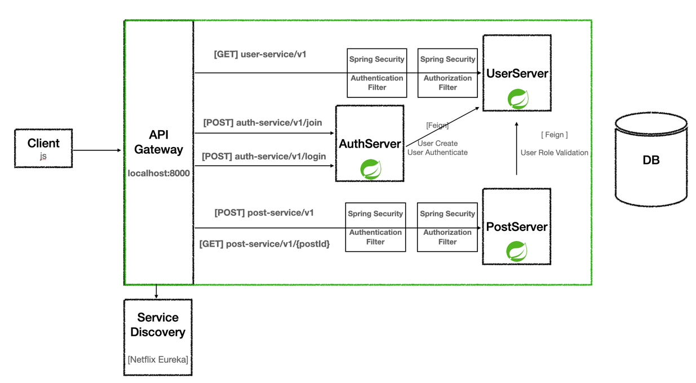

## Architecture Draft (Ver. 23/12/18)

---

## `마일스톤 1`

- [x] `Netflix Eureka`를 활용하여 `Service Discovery`를 가동한다.

- [x] `API Gateway`를 가동하여 각 마이크로 서버에 요청을 `로드밸런싱`한다.
  - [x] `Auth Server`
  - [x] `User Server`
  - [x] `Post Server`

- [x] 유저는 회원가입을 할 수 있다.
  - [x] 유저는 로그인을 할 수 있다.

- [x] 유저는 게시글을 작성할 수 있다.
  - [x] 유저는 공지사항을 작성할 수 없다. (JWT Filter에서 인가가 거부된다.)

- [x] 관리자는 공지사항을 작성할 수 있다. (JWT Filter에서 인가가 허용된다.)

### Config Server

- [ ] 모든 마이크로서버가 사용할 설정 파일을 관리한다.

---

## `마일스톤 2`

- [ ] 마이크로서버와 통신방식을 `마일스톤 1`의 `OpenFeign`에서 `gRPC`로 변경한다.

- [ ] `Circuit Breaker`를 통해 `fault-tolerance(장애허용)`를 확보한다.

---

## `마일스톤 3`

- [ ] 관리자가 공지사항을 작성하면 모든 사용자에게 알림을 전송한다.
  - [ ] 이 때 `이벤트 기반` 처리를 위해 `메세지 브로커(Kafka)`를 활용한다.